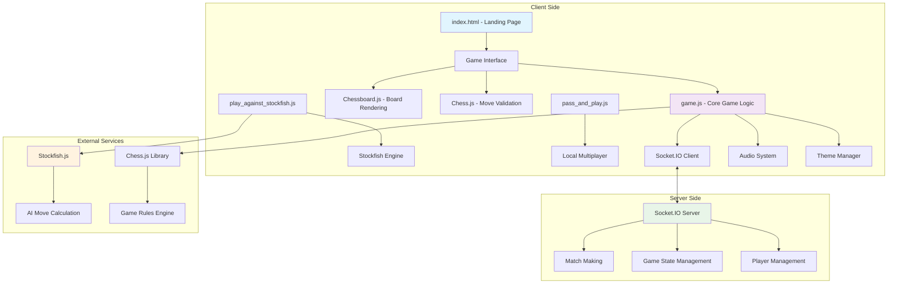

# 🏆 ChessMaster

<div align="center">
  
  
  [](https://opensource.org/licenses/MIT)
  [](https://developer.mozilla.org/en-US/docs/Web/JavaScript)
  [](https://developer.mozilla.org/en-US/docs/Web/HTML)
  [](https://developer.mozilla.org/en-US/docs/Web/CSS)
  [](https://socket.io/)

  **Experience the royal game like never before with advanced AI, interactive lessons, and global multiplayer.**
</div>

## 📋 Table of Contents

- [🎯 Overview](#-overview)
- [✨ Features](#-features)
- [🏗️ Architecture](#️-architecture)
- [🚀 Quick Start](#-quick-start)
- [🎮 Game Modes](#-game-modes)
- [🔧 Configuration](#-configuration)
- [📁 Project Structure](#-project-structure)
- [🎨 Themes](#-themes)
- [🔊 Audio System](#-audio-system)
- [🌐 Multiplayer](#-multiplayer)
- [🤖 AI Integration](#-ai-integration)
- [📱 Responsive Design](#-responsive-design)
- [🛠️ Development](#️-development)
- [🤝 Contributing](#-contributing)
- [📄 License](#-license)
- [👥 Credits](#-credits)

## 🎯 Overview

ChessMaster is a comprehensive web-based chess platform that combines the classic game of chess with modern web technologies. Built with vanilla JavaScript, HTML5, and CSS3, it offers multiple game modes including AI opponents, pass-and-play, and real-time multiplayer matches.

### Key Highlights

- 🎮 **Multiple Game Modes**: Play against AI (Stockfish), friends locally, or online opponents
- 🎨 **Customizable Themes**: Multiple board and piece themes
- 🔊 **Immersive Audio**: Sound effects for moves, captures, checks, and game events
- 📱 **Responsive Design**: Optimized for desktop, tablet, and mobile devices
- ⚡ **Real-time Multiplayer**: Socket.IO powered online gameplay
- 🧠 **Advanced AI**: Integrated Stockfish engine for challenging gameplay
- 📊 **Game Analysis**: Move history, position evaluation, and game statistics
- 👤 **User Profiles**: Player authentication and profile management

## ✨ Features

### 🎯 Core Gameplay Features
- **Legal Move Validation**: Comprehensive chess rule enforcement
- **Move Highlighting**: Visual indicators for possible moves
- **Piece Promotion**: Interactive pawn promotion with piece selection
- **Castling & En Passant**: Full support for special chess moves
- **Check Detection**: Visual and audio indicators for check situations
- **Checkmate & Stalemate**: Automatic game end detection
- **Threefold Repetition**: Draw detection for repeated positions
- **50-Move Rule**: Automatic draw detection

### 🎮 Game Modes
- **Play Against Stockfish**: Challenge the powerful Stockfish AI engine
- **Pass and Play**: Local multiplayer for two players on one device
- **Online Multiplayer**: Real-time matches with players worldwide
- **Position Evaluation**: Analyze board positions and get strategic insights

### 🎨 Visual & Audio Experience
- **Multiple Themes**: Wooden, marble, neon, and classic board themes
- **Smooth Animations**: Fluid piece movements and transitions
- **Sound Effects**: Contextual audio for different game events
- **Responsive UI**: Adaptive interface for all screen sizes

### 👤 User Management
- **User Authentication**: Secure sign-in and profile management
- **Player Statistics**: Track wins, losses, and game history
- **Custom Profiles**: Personalized player information

## 🏗️ Architecture



## 🚀 Quick Start

### Prerequisites
- Modern web browser (Chrome, Firefox, Safari, Edge)
- Internet connection for multiplayer features
- Local web server (optional, for development)

### Installation

1. **Clone the Repository**
   ```bash
   git clone https://github.com/yourusername/chessmaster.git
   cd chessmaster
   ```

2. **Open in Browser**
   ```bash
   # Option 1: Direct file opening
   open index.html
   
   # Option 2: Using Python HTTP server
   python -m http.server 8000
   # Then visit http://localhost:8000
   
   # Option 3: Using Node.js http-server
   npx http-server
   ```

3. **Start Playing**
   - Navigate to the landing page
   - Choose your preferred game mode
   - Create an account or play as guest
   - Enjoy your chess experience!

## 🎮 Game Modes

### 🤖 Play Against Stockfish
- **File**: `play_against_stockfish.html`
- **Features**: 
  - Adjustable AI difficulty levels
  - Position analysis and evaluation
  - Move suggestions and hints
  - Opening book integration

### 👥 Pass and Play
- **File**: `play_and_pass.html`
- **Features**:
  - Local two-player gameplay
  - Turn-based mechanics
  - Move history tracking
  - Game state persistence

### 🌐 Online Multiplayer
- **File**: `game.html`
- **Features**:
  - Real-time opponent matching
  - Live chat functionality
  - Spectator mode
  - Tournament support

### 📊 Position Evaluation
- **File**: `evaluate.html`
- **Features**:
  - Static position analysis
  - Material balance calculation
  - Piece activity assessment
  - Strategic recommendations

## 🔧 Configuration

### Environment Variables
```javascript
// Socket.IO Server Configuration
const SOCKET_SERVER = "https://chess-game-backend-z158.onrender.com";

// Stockfish Configuration
const STOCKFISH_DEPTH = 15; // AI thinking depth
const STOCKFISH_TIME = 1000; // Time limit in milliseconds
```

### Audio Settings
```javascript
// Audio file paths
const SOUNDS = {
    move: './sounds/move.mp3',
    capture: './sounds/capture.mp3',
    check: './sounds/check.mp3',
    castle: './sounds/castle.mp3',
    start: './sounds/start.mp3',
    end: './sounds/end.mp3'
};
```

## 📁 Project Structure

```
ChessMaster-frontend/
├── 📄 index.html              # Landing page
├── 🎨 index.css               # Landing page styles
├── ⚡ index.js                # Landing page logic
├── 🎮 game.html               # Main game interface
├── 🎨 game.css                # Game interface styles
├── ⚡ game.js                 # Core game logic
├── 🤖 play_against_stockfish.html
├── 🎨 play_against_stockfish.css
├── ⚡ play_against_stockfish.js
├── 👥 play_and_pass.html
├── 🎨 pass_and_play.css
├── ⚡ pass_and_play.js
├── 📊 evaluate.html
├── 🎨 evaluate.css
├── ⚡ evaluate.js
├── 👤 signin.html
├── 🎨 signin.css
├── ⚡ signin.js
├── 📖 rules.html
├── 👤 profile.html
├── 🧠 stockfish.js            # Stockfish engine
├── 💬 chess_quotes.js         # Inspirational chess quotes
├── 📁 lib/
│   └── chessboardjs-1.0.0/    # Chessboard.js library
├── 📁 images/                 # Chess piece images
├── 📁 sounds/                 # Audio files
├── 📄 LICENSE                 # MIT License
└── 📄 README.md              # This file
```

## 🎨 Themes

ChessMaster supports multiple visual themes:

### Available Themes
- **🌳 Wooden**: Classic wooden board with traditional pieces
- **🏛️ Marble**: Elegant marble texture with sophisticated pieces
- **💫 Neon**: Modern neon-style with glowing effects
- **📚 Classic**: Traditional tournament-style appearance

### Theme Implementation
```javascript
const themes = {
    wooden: {
        lightSquare: '#f0d9b5',
        darkSquare: '#b58863',
        highlight: '#ffff00'
    },
    marble: {
        lightSquare: '#e8e8e8',
        darkSquare: '#4a4a4a',
        highlight: '#00ff00'
    }
    // ... more themes
};
```

## 🔊 Audio System

### Sound Effects
- **Move Sound**: Played on piece movement
- **Capture Sound**: Triggered when capturing pieces
- **Check Sound**: Alert for check situations
- **Castle Sound**: Special sound for castling moves
- **Game Start/End**: Audio cues for game state changes

### Audio Controls
```javascript
// Enable/disable audio
const audioEnabled = localStorage.getItem('audioEnabled') !== 'false';

// Volume control
const audioVolume = parseFloat(localStorage.getItem('audioVolume')) || 0.5;
```

## 🌐 Multiplayer

### Real-time Features
- **Socket.IO Integration**: Bi-directional communication
- **Match Making**: Automatic opponent pairing
- **Live Chat**: In-game messaging system
- **Spectator Mode**: Watch ongoing games
- **Reconnection**: Automatic reconnection on disconnect

### Server Events
```javascript
// Client-side event handlers
socket.on('game_start', handleGameStart);
socket.on('move_made', handleOpponentMove);
socket.on('game_end', handleGameEnd);
socket.on('chat_message', handleChatMessage);
```

## 🤖 AI Integration

### Stockfish Engine
- **Version**: Stockfish.js (WebAssembly)
- **Difficulty Levels**: 1-20 (adjustable depth)
- **Features**:
  - Position evaluation
  - Best move calculation
  - Opening book
  - Endgame tablebase

### AI Configuration
```javascript
// Stockfish settings
stockfish.postMessage('setoption name Skill Level value 15');
stockfish.postMessage('setoption name Depth value 15');
stockfish.postMessage('go depth 15');
```

## 📱 Responsive Design

### Breakpoints
- **Mobile**: < 768px
- **Tablet**: 768px - 1024px
- **Desktop**: > 1024px

### Adaptive Features
- Scalable chessboard
- Touch-friendly controls
- Optimized layouts
- Gesture support

## 🛠️ Development

### Development Setup
```bash
# Clone repository
git clone https://github.com/yourusername/chessmaster.git

# Navigate to project
cd chessmaster

# Start development server
python -m http.server 8000
# or
npx http-server
```

### Code Style Guidelines
- Use ES6+ JavaScript features
- Follow semantic HTML structure
- Implement CSS Grid and Flexbox
- Maintain consistent naming conventions

### Testing
```bash
# Manual testing checklist
- [ ] All game modes functional
- [ ] Responsive design works
- [ ] Audio system operational
- [ ] Multiplayer connectivity
- [ ] AI difficulty levels
- [ ] Theme switching
- [ ] User authentication
```

## 🤝 Contributing

We welcome contributions! Please follow these steps:

1. **Fork the Repository**
2. **Create Feature Branch**
   ```bash
   git checkout -b feature/amazing-feature
   ```
3. **Commit Changes**
   ```bash
   git commit -m 'Add amazing feature'
   ```
4. **Push to Branch**
   ```bash
   git push origin feature/amazing-feature
   ```
5. **Open Pull Request**

### Contribution Guidelines
- Follow existing code style
- Add comments for complex logic
- Test thoroughly before submitting
- Update documentation as needed

## 📄 License

This project is licensed under the MIT License - see the [LICENSE](LICENSE) file for details.

```
MIT License

Copyright (c) 2024 Patel Deep

Permission is hereby granted, free of charge, to any person obtaining a copy
of this software and associated documentation files (the "Software"), to deal
in the Software without restriction, including without limitation the rights
to use, copy, modify, merge, publish, distribute, sublicense, and/or sell
copies of the Software, and to permit persons to whom the Software is
furnished to do so, subject to the following conditions:

The above copyright notice and this permission notice shall be included in all
copies or substantial portions of the Software.

THE SOFTWARE IS PROVIDED "AS IS", WITHOUT WARRANTY OF ANY KIND, EXPRESS OR
IMPLIED, INCLUDING BUT NOT LIMITED TO THE WARRANTIES OF MERCHANTABILITY,
FITNESS FOR A PARTICULAR PURPOSE AND NONINFRINGEMENT. IN NO EVENT SHALL THE
AUTHORS OR COPYRIGHT HOLDERS BE LIABLE FOR ANY CLAIM, DAMAGES OR OTHER
LIABILITY, WHETHER IN AN ACTION OF CONTRACT, TORT OR OTHERWISE, ARISING FROM,
OUT OF OR IN CONNECTION WITH THE SOFTWARE OR THE USE OR OTHER DEALINGS IN THE
SOFTWARE.
```

## 👥 Credits

### Development Team
- **Lead Developer**: Patel Deep
- **UI/UX Design**: ChessMaster Team
- **Backend Development**: ChessMaster Team

### Third-Party Libraries
- **[Chess.js](https://github.com/jhlywa/chess.js)**: Chess game logic
- **[Chessboard.js](https://chessboardjs.com/)**: Interactive chessboard
- **[Stockfish.js](https://github.com/nmrugg/stockfish.js)**: Chess engine
- **[Socket.IO](https://socket.io/)**: Real-time communication
- **[Tailwind CSS](https://tailwindcss.com/)**: Utility-first CSS framework

### Special Thanks
- Chess.com for inspiration
- Lichess for open-source chess development
- The chess programming community
- All contributors and testers

---

<div align="center">
  <p>Made with ❤️ by the ChessMaster Team</p>
  <p>
    <a href="#-table-of-contents">Back to Top</a> •
    <a href="https://github.com/yourusername/chessmaster/issues">Report Bug</a> •
    <a href="https://github.com/yourusername/chessmaster/issues">Request Feature</a>
  </p>
</div>
